# Model Metrics Plot for gmm deit

## PLOTS

> ratio_test_block_mem

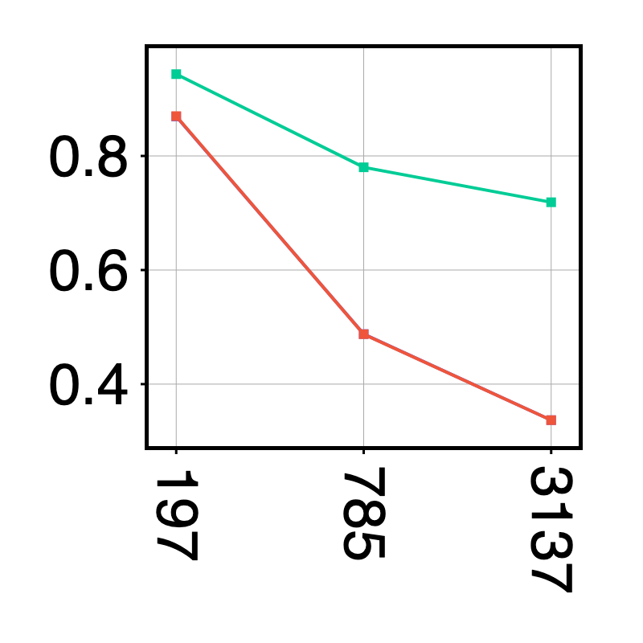

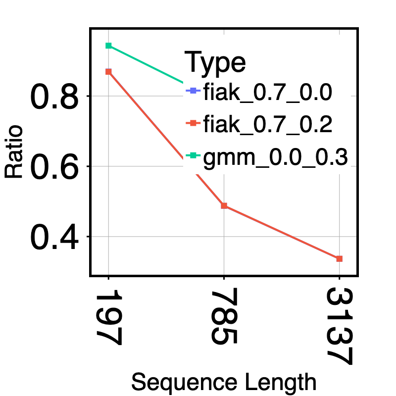

> ratio_test_block_flops

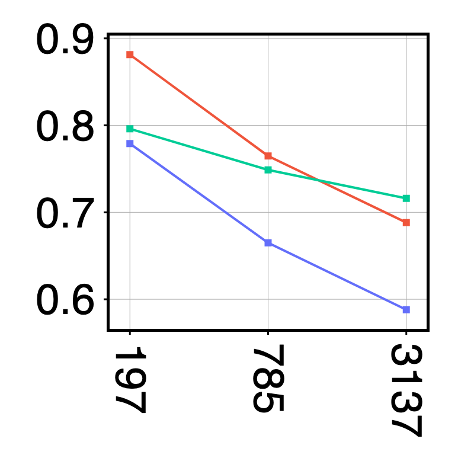

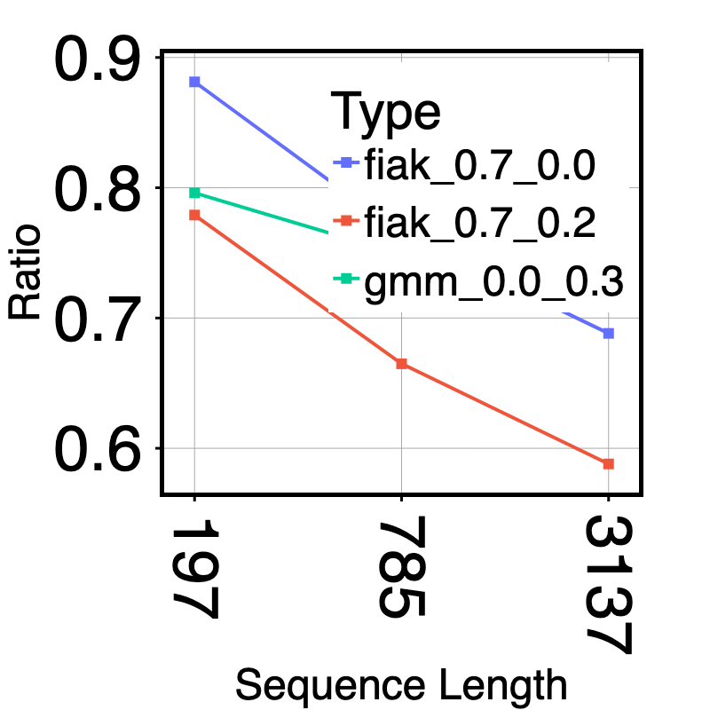

> ratio_test_block_time

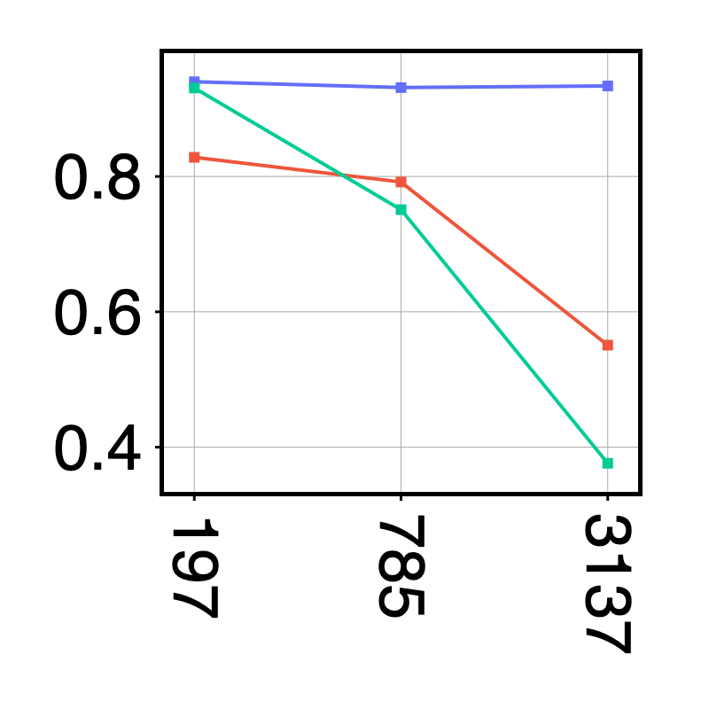

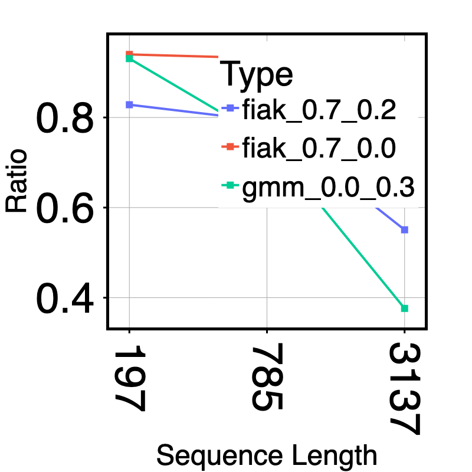

> ratio_test_model_mem

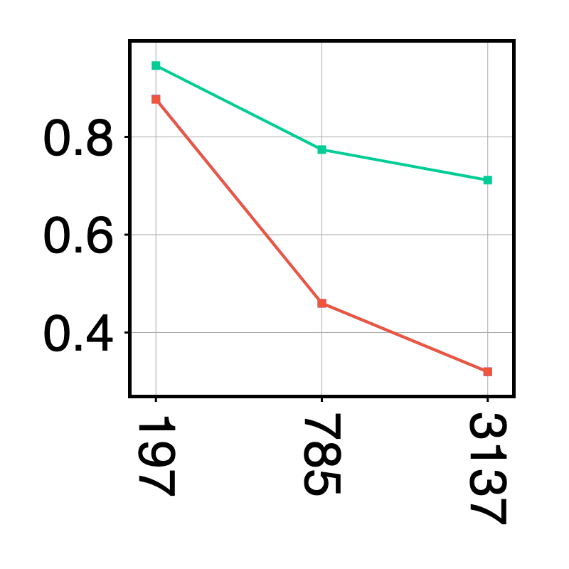

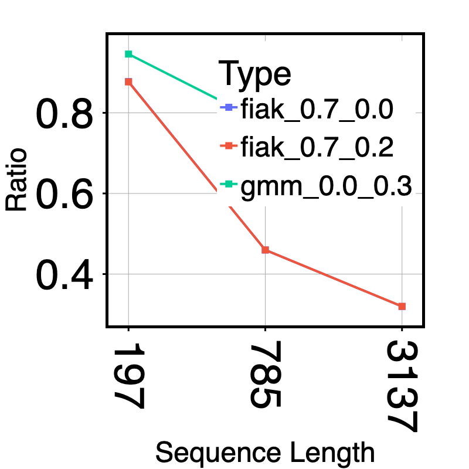

> ratio_test_model_flops

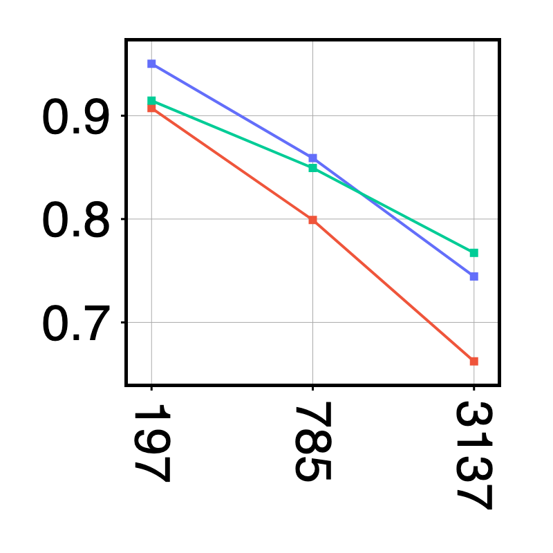

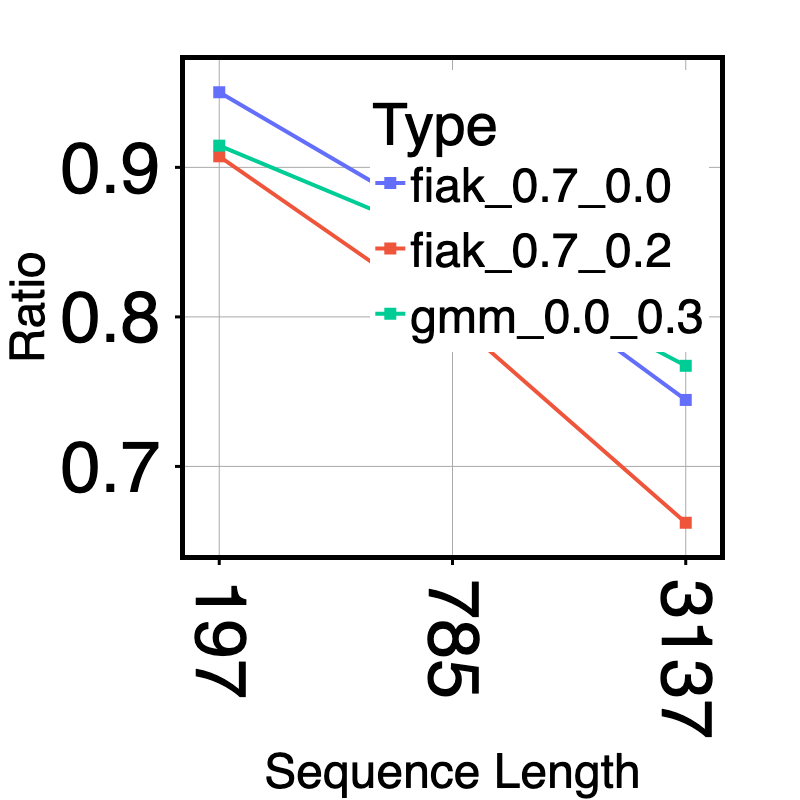

> ratio_test_model_time

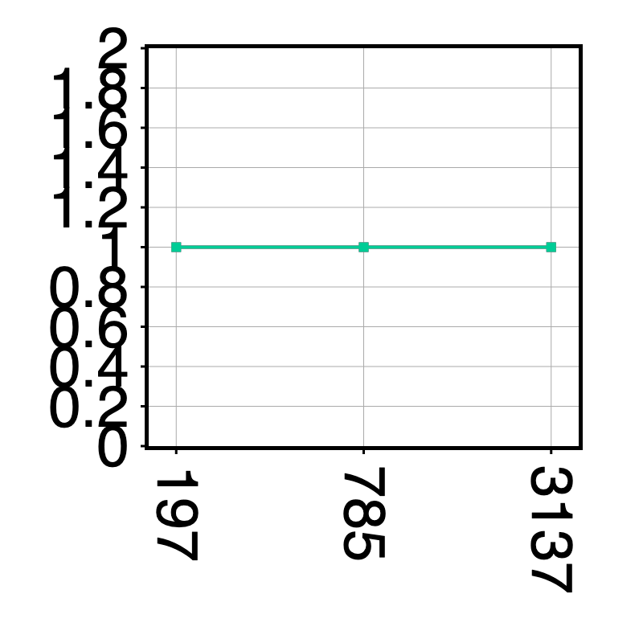

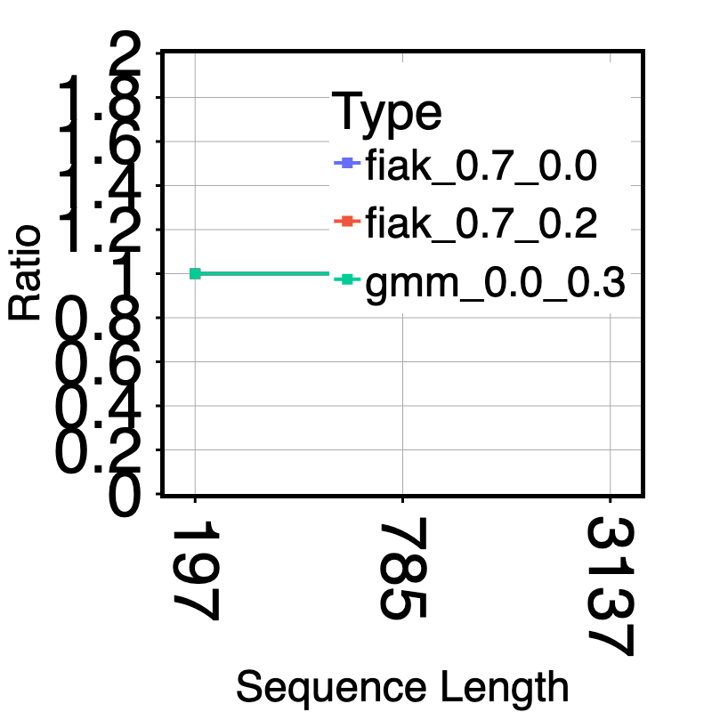

